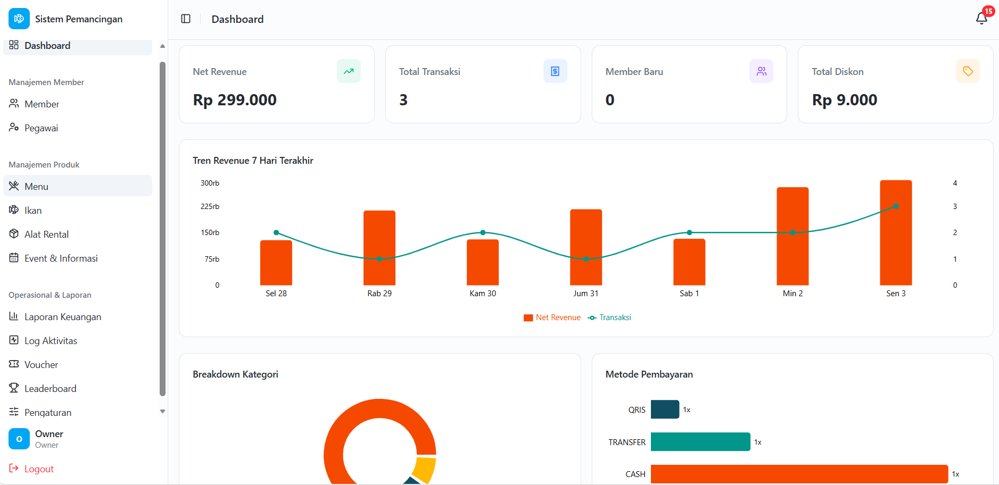
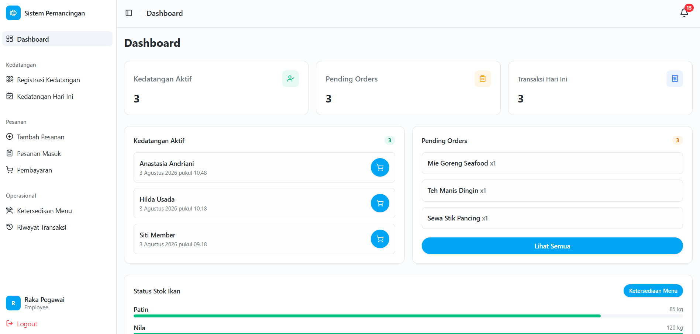

# Sistem Informasi Pemancingan Sutoyo

> **Undergraduate Thesis Project (Skripsi)** — Fishing Pond Management Information System

[](https://react.dev)
[](https://laravel.com)
[](https://vitejs.dev)
[](https://tailwindcss.com)
[](./LICENSE)

---

## Overview

**Sistem Informasi Pemancingan Sutoyo** is a full-stack web-based management information system designed for a fishing pond business. It digitises and automates the core operational workflows — from customer check-in and order management to checkout, digital receipts, and financial reporting.

This system was developed as an undergraduate thesis (skripsi) to address the operational inefficiencies commonly found in small- to medium-scale fishing pond businesses that still rely on manual, paper-based processes.

The key pain points the system resolves:

| #   | Problem                                                | Solution                                                                                                                                                                                                 |
| --- | ------------------------------------------------------ | -------------------------------------------------------------------------------------------------------------------------------------------------------------------------------------------------------- |
| a   | Manual check-in is error-prone and creates queues      | QR-code scan or name search for fast digital check-in                                                                                                                                                    |
| b   | No real-time fish stock visibility                     | Live stock monitoring dashboard with low-stock threshold alerts                                                                                                                                          |
| c   | No customer loyalty system                             | Point accumulation, tier progression (Regular → Bronze → Silver → Gold), monthly automatic voucher disbursement, and automatic points expiry after 180 days of inactivity (with a 7-day advance warning) |
| d   | Manual financial reporting requires significant effort | Automated daily, weekly, and monthly financial reports with Excel export, including payment proof status                                                                                                 |
| e   | Unorganised food and equipment rental orders           | Structured pending order system scoped per customer arrival session, with production status tracking (Pending → Processing → Done) and the ability to cancel individual orders before checkout           |
| f   | No automatic proof of transaction for customers        | Auto-generated digital receipt (Nota) after every checkout, with options to print or share via WhatsApp                                                                                                  |

---

## Screenshots

|                         Landing Page                          |                      Owner Dashboard                      |
| :-----------------------------------------------------------: | :-------------------------------------------------------: |
|             |    |
|                    **Employee Dashboard**                     |                   **Member Dashboard**                    |
|  |  |

---

## Tech Stack

### Frontend (`main` branch)

| Technology      | Purpose                            |
| --------------- | ---------------------------------- |
| React 18        | UI component library               |
| Vite            | Build tool and dev server          |
| React Router    | Client-side routing                |
| Tailwind CSS v4 | Utility-first styling              |
| shadcn/ui       | Accessible UI component primitives |
| Framer Motion   | Animations and transitions         |
| Recharts        | Data visualisation and charts      |
| Axios           | HTTP client for API requests       |
| Lucide React    | Icon library                       |

### Backend (`backend` branch)

| Technology        | Purpose                                                                          |
| ----------------- | -------------------------------------------------------------------------------- |
| Laravel 12        | PHP application framework                                                        |
| Laravel Sanctum   | SPA authentication                                                               |
| MySQL             | Relational database                                                              |
| Laravel Scheduler | Automated background tasks (voucher disbursement, points expiry, auto check-out) |

---

## Features by Role

### 👑 Owner

- Full dashboard with revenue charts, fish stock status, and leaderboard overview
- Manage fish types, menu items (including marking up to 3 items as "Menu Spesial"), and rental inventory
- Manage members and view per-member transaction history
- Generate and export financial reports (daily, weekly, monthly), including payment proof status
- Create and publish events and announcements
- Configure loyalty tiers and discount thresholds
- Receive low-stock alerts for fish inventory

### 👷 Employee

- QR-code scan or name-based member check-in
- Guest check-in (walk-in customers)
- Manage pending food and rental orders per arrival, including production status updates (Pending → Processing → Done) and order cancellation before checkout
- Process checkout: calculate totals, apply member discounts and vouchers, record payment, and upload payment proof for transfer/QRIS transactions
- Automatically generate a transaction receipt (Nota) after checkout, with options to print or send via WhatsApp
- Reprint or resend receipts from transaction history
- Monitor active arrivals in real time
- View fish stock levels

### 🎣 Member

- Register and receive a personal QR membership card
- View tier status, accumulated points, and discount rate
- Browse menus with "Menu Spesial" items highlighted
- Browse and redeem vouchers
- Receive in-app notifications for points expiry warnings (7 days before expiry) and points expiration
- View full transaction and arrival history
- Access the public leaderboard and events page

### 🌐 Public / Guest

- View the landing page with live leaderboard and latest events
- View a promotional popup for active "Menu Spesial" items
- Register for a membership account
- Browse the FAQ and facility information without logging in

---

## System Flow

```
Customer Arrives
     │
     ▼
QR Scan / Name Search → Check-In Created (Member or Guest)
     │
     ▼
Employee Adds Pending Orders (food, rentals)
     │
     ▼
Production Status Updated: Pending → Processing → Done
(orders can be cancelled individually before checkout)
     │
     ▼
Checkout → Payment Recorded
(payment proof required for Transfer / QRIS)
     │
     ▼
Deposit settled or refunded
     │
     ▼
Points & Voucher Updated (members only)
     │
     ▼
Receipt (Nota) Generated → Print / Send via WhatsApp
     │
     ▼
Auto Check-Out (via Scheduler if session not closed manually)
```

> **Background Schedulers:** the system runs scheduled tasks for monthly voucher disbursement and automatic points expiry — points are reset after 180 days of customer inactivity, with an in-app warning sent 7 days in advance.

---

## Project Structure

This repository uses **two folder**:

| Folder    | Contents            |
| --------- | ------------------- |
| `main`    | React frontend      |
| `backend` | Laravel 12 REST API |

### Frontend

```
frontend/
├── docs/               # Project screenshots
├── public/             # Static assets
├── src/
│   ├── components/     # Shared and feature-specific UI components
│   ├── constants/      # Static data constants (FAQ, config)
│   ├── hooks/          # Custom React hooks
│   ├── pages/          # Route-level page components (owner/, employee/, member/, landing/)
│   ├── services/       # Axios API service modules
│   └── utils/          # Utility helpers (formatDate, formatCurrency, etc.)
├── .env                # Environment variables (not committed)
├── index.html
├── vite.config.js
└── package.json
```

---

## Getting Started

### 8a. Frontend

**Prerequisites:** Node.js 18+

```bash
# Clone the repository
git clone https://github.com/<your-username>/<repo-name>.git
cd <repo-name>

# Install dependencies
npm install

# Configure environment
cp .env.example .env
# Set VITE_API_BASE_URL in .env (see Environment Variables section)

# Start development server
npm run dev
```

### 8b. Backend

The backend lives on a separate branch. See the full source at:
**[`backend` branch](../../tree/backend)**

**Prerequisites:** PHP 8.2+, Composer, MySQL

```bash
# Switch to the backend branch
git checkout backend

# Install dependencies
composer install

# Configure environment
cp .env.example .env
# Edit .env — set APP_URL and switch DB_CONNECTION to mysql,
# then uncomment and fill in DB_HOST, DB_DATABASE, DB_USERNAME, DB_PASSWORD

# Run migrations and seeders
php artisan migrate --seed

# Link storage for public file access
php artisan storage:link

# Start the API server
php artisan serve

# (Optional) Run queue worker for background jobs
php artisan queue:work

# (Optional) Run task scheduler
php artisan schedule:run
```

---

## Environment Variables

### Frontend (`.env`)

| Variable            | Description                 | Example                     |
| ------------------- | --------------------------- | --------------------------- |
| `VITE_API_BASE_URL` | Base URL of the Laravel API | `http://localhost:8000/api` |

### Backend (`.env`)

| Variable        | Description                                    | Example                 |
| --------------- | ---------------------------------------------- | ----------------------- |
| `APP_URL`       | Laravel application URL                        | `http://127.0.0.1:8000` |
| `DB_CONNECTION` | Database driver (default: `sqlite`)            | `mysql`                 |
| `DB_HOST`       | Database host _(commented out by default)_     | `127.0.0.1`             |
| `DB_DATABASE`   | Database name _(commented out by default)_     | `pemancingan`           |
| `DB_USERNAME`   | Database username _(commented out by default)_ | `root`                  |
| `DB_PASSWORD`   | Database password _(commented out by default)_ | _(your password)_       |

> ⚠️ The default `DB_CONNECTION` is `sqlite`. To use MySQL, change it to `mysql` and uncomment the `DB_*` lines in `.env`. `SANCTUM_STATEFUL_DOMAINS` and `FRONTEND_URL` are not pre-defined in `.env.example` — add them manually if required by your Sanctum/CORS configuration.

---

## API

The backend exposes a RESTful JSON API documented using `.http` files (compatible with the [VS Code REST Client](https://marketplace.visualstudio.com/items?itemName=humao.rest-client) extension). These files are located in the `backend` branch.

**API Groups:**

| Group        | Description                                                        |
| ------------ | ------------------------------------------------------------------ |
| **Public**   | Landing page data (leaderboard, events, fish types, special menus) |
| **Auth**     | Login, logout, register                                            |
| **Member**   | Profile, points, vouchers, transaction history                     |
| **Employee** | Check-in, arrivals, pending orders, checkout, receipts             |
| **Owner**    | Members, reports, inventory, events, fish stocks, menu management  |

---

## Database Schema

Key tables in the system:

| Table               | Description                                       |
| ------------------- | ------------------------------------------------- |
| `users`             | Authentication accounts (owner, employee, member) |
| `members`           | Member profile, tier, points, QR code             |
| `arrivals`          | Each customer visit session                       |
| `transactions`      | Checkout payment records per arrival              |
| `transaction_items` | Line items within a transaction                   |
| `pending_orders`    | Active food/rental orders during a session        |
| `vouchers`          | Issued vouchers and redemption state              |

> 📋 The full Entity Relationship Diagram (ERD) is available in the `backend` branch.
>
> Recent additions: `is_special` (`menus`), `payment_proof` (`transactions`), `points_expiry_warned_at` (`members`), and an expanded `production_status` enum (`pending`, `processing`, `done`, `cancelled`) on `pending_orders`.

---

## License

This project is licensed under the [MIT License](./LICENSE).
