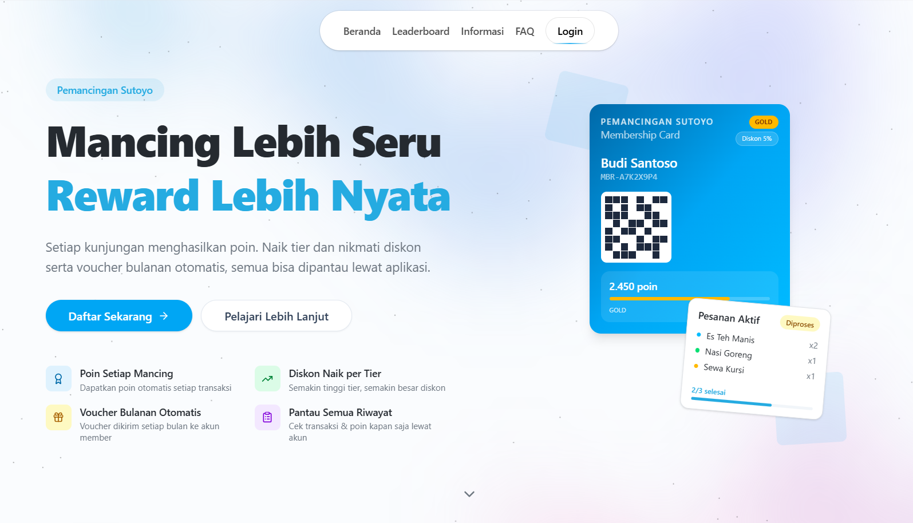
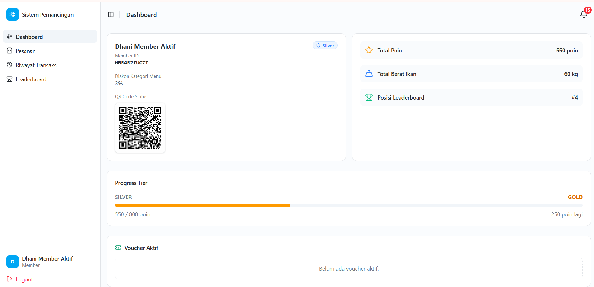
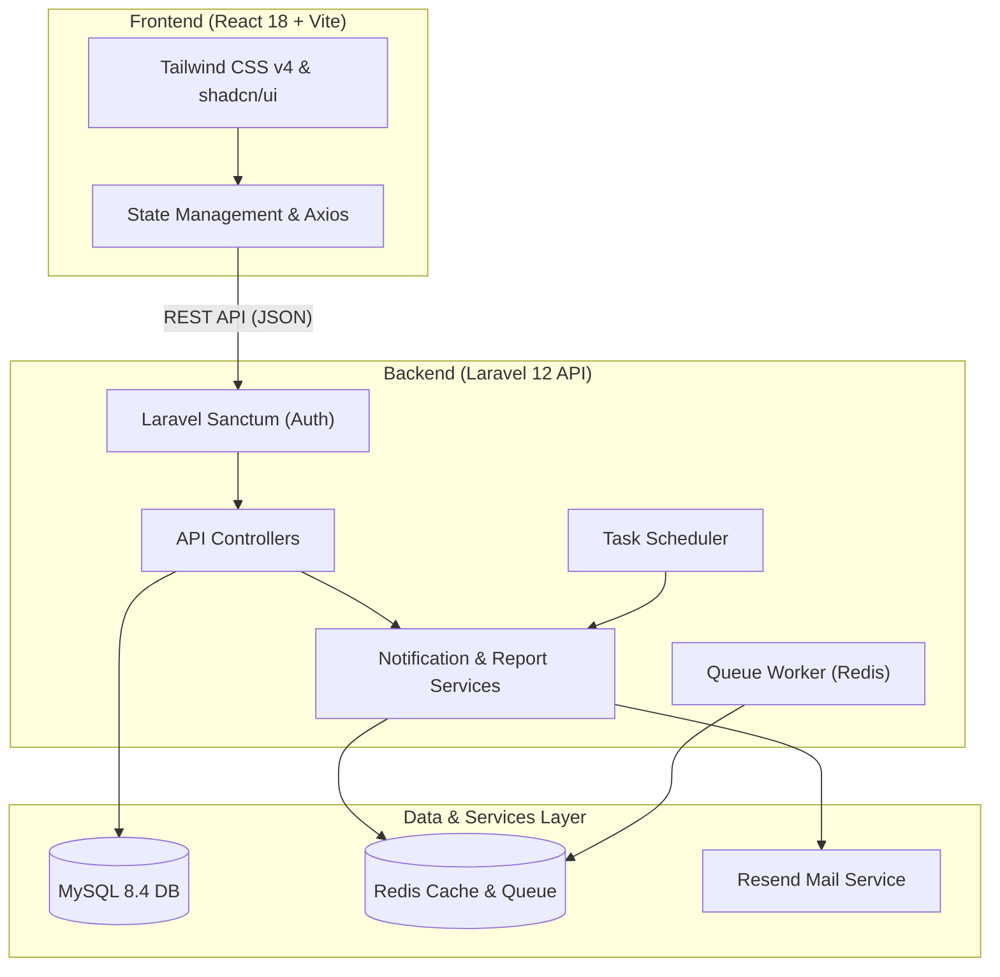
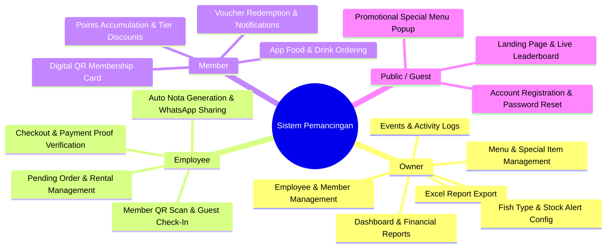
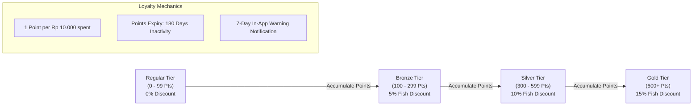
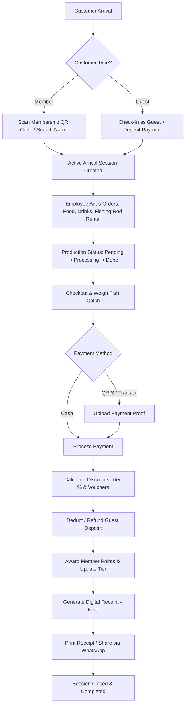

# Sistem Informasi Pemancingan Sutoyo

> **Undergraduate Thesis Project (Skripsi)** — Fishing Pond Management Information System

[](https://react.dev)
[](https://laravel.com)
[](https://vitejs.dev)
[](https://tailwindcss.com)
[](https://pestphp.com)
[](./LICENSE)

---

## Overview

**Sistem Informasi Pemancingan Sutoyo** is a full-stack web-based management information system designed for a fishing pond business. It digitises and automates the core operational workflows — from customer check-in and order management to checkout, digital receipts, and financial reporting.

This system was developed as an undergraduate thesis (skripsi) to address the operational inefficiencies commonly found in small- to medium-scale fishing pond businesses that still rely on manual, paper-based processes.

The key pain points the system resolves:

| #   | Problem                                                | Solution                                                                                                                                                                                                 |
| --- | ------------------------------------------------------ | -------------------------------------------------------------------------------------------------------------------------------------------------------------------------------------------------------- |
| a   | Manual check-in is error-prone and creates queues      | QR-code scan or name search for fast digital check-in                                                                                                                                                    |
| b   | No real-time fish stock visibility                     | Live stock monitoring dashboard with low-stock threshold alerts                                                                                                                                          |
| c   | No customer loyalty system                             | Point accumulation, tier progression (Regular → Bronze → Silver → Gold), monthly automatic voucher disbursement, and automatic points expiry after 180 days of inactivity (with a 7-day advance warning) |
| d   | Manual financial reporting requires significant effort | Automated daily, weekly, and monthly financial reports with Excel export, including payment proof status                                                                                                 |
| e   | Unorganised food and equipment rental orders           | Structured pending order system scoped per customer arrival session, with production status tracking (Pending → Processing → Done) and the ability to cancel individual orders before checkout           |
| f   | No automatic proof of transaction for customers        | Auto-generated digital receipt (Nota) after every checkout, with options to print or share via WhatsApp                                                                                                  |

---

## Screenshots

|                         Landing Page                         |                     Owner Dashboard                      |
| :----------------------------------------------------------: | :------------------------------------------------------: |
|             |    |
|                    **Employee Dashboard**                    |                   **Member Dashboard**                   |
|  |  |

---

## System Architecture



---

## Tech Stack

### Frontend

| Technology      | Purpose                            |
| --------------- | ---------------------------------- |
| React 18        | UI component library               |
| Vite            | Build tool and dev server          |
| React Router    | Client-side routing                |
| Tailwind CSS v4 | Utility-first styling              |
| shadcn/ui       | Accessible UI component primitives |
| Framer Motion   | Animations and transitions         |
| Recharts        | Data visualisation and charts      |
| Axios           | HTTP client for API requests       |
| Lucide React    | Icon library                       |

### Backend

| Technology                     | Purpose                                                                          |
| ------------------------------ | -------------------------------------------------------------------------------- |
| Laravel 12                     | PHP application framework                                                        |
| Laravel Sanctum                | Token-based API authentication                                                   |
| MySQL                          | Relational database                                                              |
| Redis                          | Queue driver and cache store                                                     |
| Laravel Scheduler              | Automated background tasks (voucher disbursement, points expiry, auto check-out) |
| Laravel Queue                  | Asynchronous job processing (e.g. new member notifications)                      |
| Laravel Sail                   | Docker-based local development environment                                       |
| resend/resend-laravel          | Transactional email service (reset password, notifications)                      |
| maatwebsite/excel              | Export financial reports to .xlsx                                                |
| simplesoftwareio/simple-qrcode | Generate member QR code cards                                                    |
| Pest PHP                       | Feature and unit testing framework                                               |

---

## Role Capabilities & System Features



### Owner

- Full dashboard with revenue charts, fish stock status, and leaderboard overview
- Manage fish types, menu items (including marking up to 3 items as "Menu Spesial"), and rental inventory
- **Manage employees** — add, edit, update password, deactivate, and reactivate employee accounts
- Manage members: view active, pending, rejected, and deactivated members; approve, reject, reactivate, or deactivate member accounts; view per-member transaction history
- Generate and export financial reports (daily, weekly, monthly), including payment proof status
- Export transaction reports to Excel (.xlsx)
- Create and publish events and announcements
- Configure loyalty tiers and discount thresholds
- Configure voucher issuance rules (voucher config)
- Configure QRIS payment information shown at checkout
- Configure guest tariff and deposit settings
- View activity log — a full history of all transactions and orders processed by employees
- Receive real-time in-app low-stock alerts for fish inventory

### Employee

- QR-code scan or name-based member check-in
- Guest check-in (walk-in customers with deposit)
- Search active arrivals by member name or code
- Manage pending food and rental orders per arrival, including production status updates (Pending → Processing → Done) and order cancellation before checkout
- Toggle rental item availability directly from the checkout screen
- Process checkout: calculate totals, apply member discounts and vouchers, record payment, and upload payment proof for transfer/QRIS transactions
- Automatically generate a transaction receipt (Nota) after checkout, with options to print or send via WhatsApp
- Reprint or resend receipts from transaction history
- Filter transaction history by date range, payment method, or transaction code
- Monitor active arrivals in real time
- View fish stock levels
- View current QRIS payment information and guest tariff configuration

### Member

- Register and receive a personal QR membership card
- View tier status, accumulated points, and discount rate
- Browse menus with "Menu Spesial" items highlighted
- Place food and drink orders directly from the app (during an active arrival session)
- View personal order history
- Browse and redeem vouchers
- Receive in-app notifications for points expiry warnings (7 days before expiry) and points expiration
- View full transaction and arrival history
- Access the public leaderboard and events page

### Public / Guest

- View the landing page with live leaderboard and latest events
- View a promotional popup for active "Menu Spesial" items
- Register for a membership account
- Request password reset via email
- Browse the FAQ and facility information without logging in

---

## Member Loyalty System



---

## System Workflow & Operational Flow



> **Background Jobs & Schedulers:**
>
> - When a new member registers, a queue job (`NotifyOwnersOfPendingMember`) immediately notifies all Owner accounts in-app.
> - The system runs scheduled tasks for **monthly voucher disbursement** and **automatic points expiry** — points are reset after 180 days of customer inactivity, with an in-app warning sent 7 days in advance.
> - When checkout reduces fish stock below the configured alert threshold, a **real-time low-stock notification** is sent to all Owner and Employee accounts.

---

## Project Structure

This repository uses a **monorepo structure** with two folders at the root:

| Folder      | Contents            |
| ----------- | ------------------- |
| `frontend/` | React frontend      |
| `backend/`  | Laravel 12 REST API |

### Frontend

```
frontend/
├── docs/               # Project screenshots
├── public/             # Static assets
├── src/
│   ├── components/     # Shared and feature-specific UI components
│   ├── constants/      # Static data constants (FAQ, config)
│   ├── hooks/          # Custom React hooks
│   ├── pages/          # Route-level page components (owner/, employee/, member/, landing/)
│   ├── services/       # Axios API service modules
│   └── utils/          # Utility helpers (formatDate, formatCurrency, etc.)
├── .env                # Environment variables (not committed)
├── index.html
├── vite.config.js
└── package.json
```

### Backend

```
backend/
├── app/
│   ├── Http/
│   │   ├── Controllers/Api/
│   │   │   ├── AuthController.php
│   │   │   ├── Employee/       # Controllers for Employee role
│   │   │   ├── Owner/          # Controllers for Owner role
│   │   │   └── Member/         # Controllers for Member role
│   │   └── Middleware/
│   ├── Jobs/
│   │   └── NotifyOwnersOfPendingMember.php   # Queue job
│   ├── Models/
│   ├── Services/               # NotificationService
│   └── Exports/                # Excel export classes (maatwebsite/excel)
├── database/
│   ├── factories/
│   ├── migrations/
│   └── seeders/                # Essential + dev-only seeders
├── routes/
│   └── api.php
├── tests/
│   ├── Feature/Auth/           # Pest feature tests (Login, Logout, Me, Register)
│   └── Pest.php
├── compose.yaml                # Laravel Sail (Docker) configuration
└── .env.example
```

---

## Getting Started

### Option A — Standard (PHP + Node.js)

**Prerequisites:** PHP 8.2+, Composer, MySQL, Node.js 18+, Redis

#### 1. Backend

```bash
cd backend

# Install PHP dependencies
composer install

# Configure environment
cp .env.example .env
# Edit .env — set DB_*, RESEND_API_KEY, FRONTEND_URL, QUEUE_CONNECTION=redis, etc.

# Generate app key
php artisan key:generate

# Run migrations and seed database
php artisan migrate --seed          # production (essential data only)
php artisan migrate:fresh --seed    # development (full dummy data)

# Link storage for public file access
php artisan storage:link

# Start the API server
php artisan serve

# (Required for queue jobs) Run queue worker in a separate terminal
php artisan queue:work

# (Optional) Run task scheduler
php artisan schedule:run
```

#### 2. Frontend

```bash
cd frontend

# Install dependencies
npm install

# Configure environment
cp .env.example .env
# Set VITE_API_BASE_URL=/api (for local proxy)

# Start development server
npm run dev
```

---

### Option B — Docker / Laravel Sail

**Prerequisites:** Docker Desktop

```bash
cd backend

cp .env.example .env
# Edit .env — set APP_PORT, VITE_PORT, DB_*, RESEND_API_KEY, etc.

# Install PHP dependencies via a temporary container (Linux/macOS)
docker run --rm -u "$(id -u):$(id -g)" \
  -v "$(pwd):/var/www/html" -w /var/www/html \
  laravelsail/php85-composer:latest \
  composer install --ignore-platform-reqs

# Start all services (Laravel + MySQL 8.4 + Redis)
./vendor/bin/sail up -d

# Generate app key, run migrations, and seed
./vendor/bin/sail artisan key:generate
./vendor/bin/sail artisan migrate:fresh --seed
./vendor/bin/sail artisan storage:link
```

> The `compose.yaml` includes: **Laravel (PHP 8.5)**, **MySQL 8.4**, and **Redis (alpine)**. Ports are controlled by `APP_PORT` (default 80) and `FORWARD_DB_PORT` (default 3306) in `.env`.

---

## Environment Variables

### Frontend (`frontend/.env`)

| Variable            | Description                 | Example                     |
| ------------------- | --------------------------- | --------------------------- |
| `VITE_API_BASE_URL` | Base URL of the Laravel API | `http://localhost:8000/api` |

> In local development, set `VITE_API_BASE_URL=/api` and configure the Vite proxy in `vite.config.js` to point to `http://127.0.0.1:8000`.

### Backend (`backend/.env`)

| Variable            | Description                                                    | Example                  |
| ------------------- | -------------------------------------------------------------- | ------------------------ |
| `APP_URL`           | Laravel application URL                                        | `http://127.0.0.1:8000`  |
| `FRONTEND_URL`      | Frontend URL (used for CORS and email links)                   | `http://localhost:5173`  |
| `APP_PORT`          | Port for Laravel Sail / Docker                                 | `8080`                   |
| `VITE_PORT`         | Port for Vite dev server inside Sail                           | `5173`                   |
| `DB_CONNECTION`     | Database driver                                                | `mysql`                  |
| `DB_HOST`           | Database host — `127.0.0.1` for local, `mysql` for Sail        | `127.0.0.1`              |
| `DB_DATABASE`       | Database name                                                  | `pemancingan`            |
| `DB_USERNAME`       | Database username                                              | `root`                   |
| `DB_PASSWORD`       | Database password                                              | _(your password)_        |
| `FORWARD_DB_PORT`   | MySQL port exposed to host when using Sail                     | `3307`                   |
| `QUEUE_CONNECTION`  | Queue driver — **must be `redis`** for background jobs to work | `redis`                  |
| `CACHE_STORE`       | Cache driver                                                   | `redis`                  |
| `REDIS_HOST`        | Redis host — `127.0.0.1` for local, `redis` for Sail           | `127.0.0.1`              |
| `REDIS_PORT`        | Redis port                                                     | `6379`                   |
| `RESEND_API_KEY`    | API key for Resend email service                               | `re_xxxxxxxxxxxx`        |
| `MAIL_MAILER`       | Mail driver                                                    | `resend`                 |
| `MAIL_FROM_ADDRESS` | Sender email address                                           | `noreply@yourdomain.com` |
| `OWNER_PASSWORD`    | Password for owner seeder account (required in production)     | _(strong password)_      |

> Warning: When running without Docker, set `DB_HOST=127.0.0.1` and `REDIS_HOST=127.0.0.1`. When running with Laravel Sail, set `DB_HOST=mysql` and `REDIS_HOST=redis` (Docker service names).

---

## API

The backend exposes a RESTful JSON API documented using `.http` files (compatible with the [VS Code REST Client](https://marketplace.visualstudio.com/items?itemName=humao.rest-client) extension). These files are located in `backend/request.http`.

**API Groups:**

| Group             | Description                                                                                                                               |
| ----------------- | ----------------------------------------------------------------------------------------------------------------------------------------- |
| **Public**        | Landing page data (leaderboard, events, fish types, special menus)                                                                        |
| **Auth**          | Login (email or phone), logout, register, forgot password, reset password                                                                 |
| **Notifications** | List notifications, mark as read, unread count (available to all authenticated roles)                                                     |
| **Member**        | Profile, points, vouchers, orders, transaction and arrival history                                                                        |
| **Employee**      | Check-in, arrivals, pending orders, checkout, receipts, rental items, configs                                                             |
| **Owner**         | Members, employees, reports (with Excel export), inventory, events, fish stocks, menu management, activity log, QRIS config, guest config |

---

## Database Schema

Key tables in the system:

| Table               | Description                                                   |
| ------------------- | ------------------------------------------------------------- |
| `users`             | Authentication accounts (owner, employee, member)             |
| `members`           | Member profile, tier, points, QR code                         |
| `member_tiers`      | Loyalty tier configuration (name, point range, discount %)    |
| `arrivals`          | Each customer visit session (member or guest)                 |
| `transactions`      | Checkout payment records per arrival                          |
| `transaction_items` | Line items within a transaction (fish, menu, rental, penalty) |
| `pending_orders`    | Active food/rental orders during a session                    |
| `vouchers`          | Issued vouchers and redemption state                          |
| `fish_types`        | Fish species with price per kg                                |
| `fish_stocks`       | Current stock level and alert threshold per fish type         |
| `restock_logs`      | History of fish stock changes (restock and checkout)          |
| `menus`             | Food and beverage items with `is_special` flag                |
| `rental_items`      | Fishing equipment available for rent                          |
| `events`            | Announcements and events published by owner                   |
| `notifications`     | In-app notifications for all roles                            |
| `guest_configs`     | Tariff and deposit configuration for walk-in guests           |
| `qris_configs`      | QRIS payment information displayed at checkout                |
| `voucher_configs`   | Rules for automatic voucher issuance                          |

> The full Entity Relationship Diagram (ERD) is available in the `backend/` directory.

---

## Testing

The backend uses **Pest PHP** as the testing framework.

```bash
cd backend

# Run all tests
php artisan test

# Or directly via Pest
./vendor/bin/pest
```

Current feature test coverage: **Auth API** (Register, Login, Logout, Me endpoint).

---

## License

This project is licensed under the [MIT License](./LICENSE).
